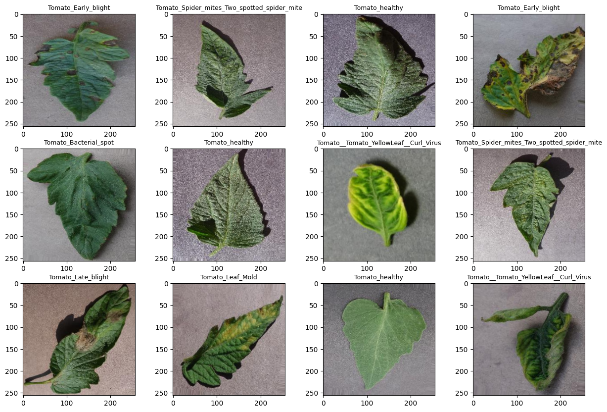
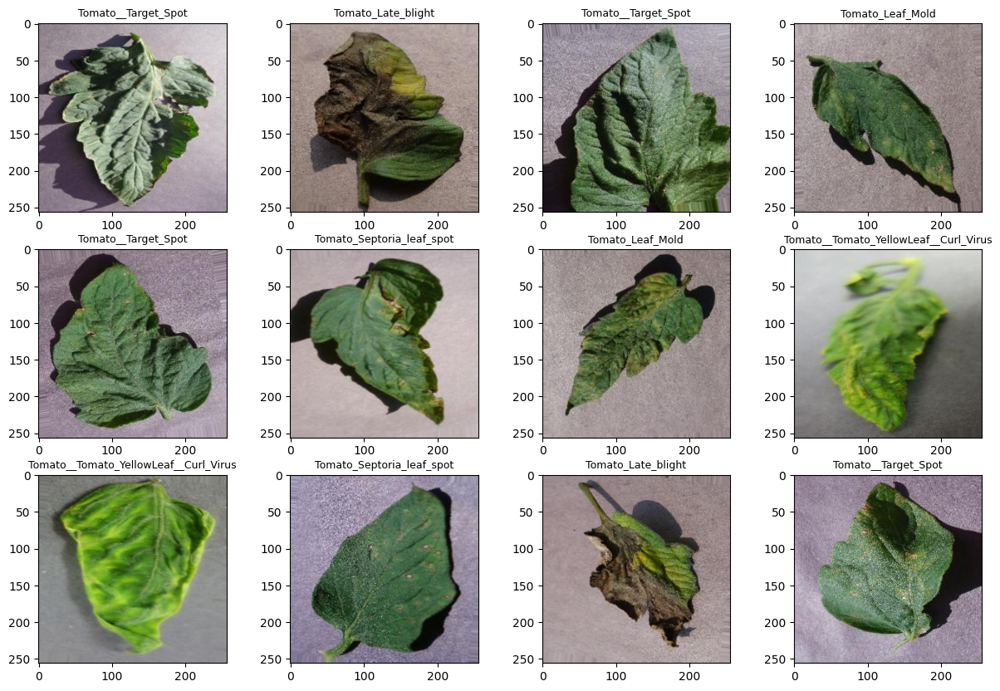
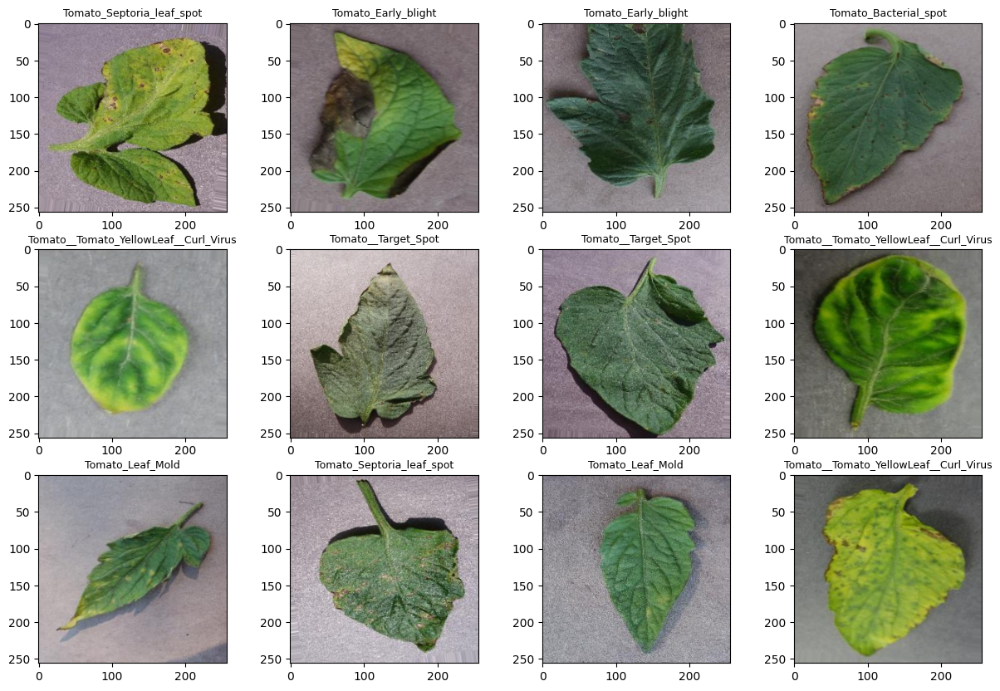
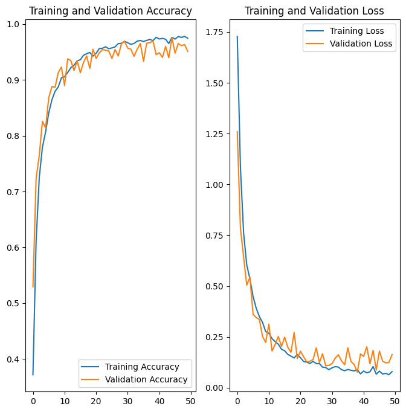
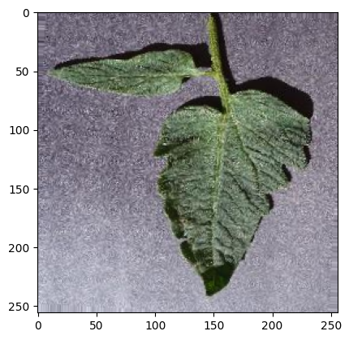

## Importing necessary libraries


```python
import tensorflow as tf
import numpy as np
import matplotlib.pyplot as plt
from tensorflow.keras import models, layers
from IPython.display import HTML

from tensorflow.keras.preprocessing.image import ImageDataGenerator
```

Global Initialization Of some important variables


```python
Image_Size = 256
Batch_Size = 32
Channels = 3
Epochs = 50
```

## Spliting the dataset
#### The dataset is divided into three sets
1. Training dataset: For training the model
2. Validation dataset : For validating the model
3. Test Dataset: For testing the model

We have used splitfolders tool to split dataset into training, validation and test directories.

$ pip install split-folders

$ splitfolders --ratio 0.8 0.1 0.1 -- ./training/PlantVillage/Tomato_disease_catagories

## Data augmentation on the fly using Keras ImageDataGenerator
Image augmentation is a technique of applying different transformations to original images which results in multiple transformed copies of the same image. Each copy, however, is different from the other in certain aspects depending on the augmentation techniques you apply like shifting, rotating, flipping, etc. Here we have train generators for all the three sets of data that is train, test and validation


```python
train_datagen = ImageDataGenerator(
    rescale=1./255,
    rotation_range=10,
    horizontal_flip=True,
    vertical_flip = True
)

train_generator = train_datagen.flow_from_directory(
    'dataset/train',
    target_size = (Image_Size, Image_Size),
    batch_size = Batch_Size,
    class_mode = 'sparse'
)
```

    Found 12804 images belonging to 10 classes.
    

The  10 classes that the tomato plant may belong are as follows:


```python
classes = list(train_generator.class_indices.keys())
classes
```


    ['Tomato_Bacterial_spot',
     'Tomato_Early_blight',
     'Tomato_Late_blight',
     'Tomato_Leaf_Mold',
     'Tomato_Septoria_leaf_spot',
     'Tomato_Spider_mites_Two_spotted_spider_mite',
     'Tomato__Target_Spot',
     'Tomato__Tomato_YellowLeaf__Curl_Virus',
     'Tomato__Tomato_mosaic_virus',
     'Tomato_healthy']


```python
plt.figure(figsize=(15, 10))
for image_batch, label_batch in train_generator:
    for i in range (12):
        ax = plt.subplot(3, 4, i + 1)
        plt.imshow(image_batch[i])
        plt.title(classes[int(label_batch[i])], fontdict={'fontsize': 9})
    break
```


    

    


```python
validation_datagen = ImageDataGenerator(
    rescale=1./255,
    rotation_range=10,
    horizontal_flip=True,
    vertical_flip = True
)

validation_generator = validation_datagen.flow_from_directory(
    'dataset/val',
    target_size = (Image_Size, Image_Size),
    batch_size = Batch_Size,
    class_mode = 'sparse'
)
```

    Found 1597 images belonging to 10 classes.
    


```python
plt.figure(figsize=(15, 10))
for image_batch, label_batch in validation_generator:
    for i in range (12):
        ax = plt.subplot(3, 4, i + 1)
        plt.imshow(image_batch[i])
        plt.title(classes[int(label_batch[i])], fontdict={'fontsize': 9})
    break
```


    

    


```python
test_datagen = ImageDataGenerator(
    rescale=1./255,
    rotation_range=10,
    horizontal_flip=True,
    vertical_flip = True
)

test_generator = test_datagen.flow_from_directory(
    'dataset/test',
    target_size = (Image_Size,Image_Size),
    batch_size = Batch_Size,
    class_mode = 'sparse'
)
```

    Found 1610 images belonging to 10 classes.
    


```python
plt.figure(figsize=(15, 10))
for image_batch, label_batch in test_generator:
    for i in range (12):
        ax = plt.subplot(3, 4, i + 1)
        plt.imshow(image_batch[i])
        plt.title(classes[int(label_batch[i])], fontdict={'fontsize': 9})
    break
```


    

    


## Model Building


```python
input_shape = (Image_Size, Image_Size, Channels)
n_classes = 10

model = models.Sequential([
    layers.InputLayer(input_shape=input_shape),
    
    layers.Conv2D(32, kernel_size = (3,3), activation='relu'),
    layers.MaxPooling2D((2, 2)),
    
    layers.Conv2D(64,  kernel_size = (3,3), activation='relu'),
    layers.MaxPooling2D((2, 2)),
    
    layers.Conv2D(64,  kernel_size = (3,3), activation='relu'),
    layers.MaxPooling2D((2, 2)),
    
    layers.Conv2D(64, (3, 3), activation='relu'),
    layers.MaxPooling2D((2, 2)),
    
    layers.Conv2D(64, (3, 3), activation='relu'),
    layers.MaxPooling2D((2, 2)),
    
    layers.Conv2D(64, (3, 3), activation='relu'),
    layers.MaxPooling2D((2, 2)),
    
    layers.Flatten(),
    layers.Dense(64, activation='relu'),
    layers.Dense(n_classes, activation='softmax'),
])
```


```python
model.summary()
```

    Model: "sequential"
    _________________________________________________________________
     Layer (type)                Output Shape              Param #   
    =================================================================
     conv2d (Conv2D)             (None, 254, 254, 32)      896       
                                                                     
     max_pooling2d (MaxPooling2D  (None, 127, 127, 32)     0         
     )                                                               
                                                                     
     conv2d_1 (Conv2D)           (None, 125, 125, 64)      18496     
                                                                     
     max_pooling2d_1 (MaxPooling  (None, 62, 62, 64)       0         
     2D)                                                             
                                                                     
     conv2d_2 (Conv2D)           (None, 60, 60, 64)        36928     
                                                                     
     max_pooling2d_2 (MaxPooling  (None, 30, 30, 64)       0         
     2D)                                                             
                                                                     
     conv2d_3 (Conv2D)           (None, 28, 28, 64)        36928     
                                                                     
     max_pooling2d_3 (MaxPooling  (None, 14, 14, 64)       0         
     2D)                                                             
                                                                     
     conv2d_4 (Conv2D)           (None, 12, 12, 64)        36928     
                                                                     
     max_pooling2d_4 (MaxPooling  (None, 6, 6, 64)         0         
     2D)                                                             
                                                                     
     conv2d_5 (Conv2D)           (None, 4, 4, 64)          36928     
                                                                     
     max_pooling2d_5 (MaxPooling  (None, 2, 2, 64)         0         
     2D)                                                             
                                                                     
     flatten (Flatten)           (None, 256)               0         
                                                                     
     dense (Dense)               (None, 64)                16448     
                                                                     
     dense_1 (Dense)             (None, 10)                650       
                                                                     
    =================================================================
    Total params: 184,202
    Trainable params: 184,202
    Non-trainable params: 0
    _________________________________________________________________
    

### Compiling the Model
We use `adam` Optimizer, `SparseCategoricalCrossentropy` for losses, `accuracy` as a metric.


```python
model.compile(
    optimizer='adam',
    loss=tf.keras.losses.SparseCategoricalCrossentropy(from_logits=False),
    metrics=['accuracy']
)
```

## Training the network


```python
history = model.fit(
    train_generator,
    steps_per_epoch=400,
    batch_size=Batch_Size,
    validation_data=validation_generator,
    validation_steps=49,
    verbose=1,
    epochs=Epochs,
)
```

    Epoch 1/50
    400/400 [==============================] - 1413s 4s/step - loss: 1.7278 - accuracy: 0.3720 - val_loss: 1.2589 - val_accuracy: 0.5293
    Epoch 2/50
    400/400 [==============================] - 1319s 3s/step - loss: 1.0851 - accuracy: 0.6105 - val_loss: 0.7843 - val_accuracy: 0.7232
    Epoch 3/50
    400/400 [==============================] - 1380s 3s/step - loss: 0.7625 - accuracy: 0.7250 - val_loss: 0.6440 - val_accuracy: 0.7647
    Epoch 4/50
    400/400 [==============================] - 1463s 4s/step - loss: 0.6044 - accuracy: 0.7794 - val_loss: 0.5045 - val_accuracy: 0.8259
    Epoch 5/50
    400/400 [==============================] - 1485s 4s/step - loss: 0.5357 - accuracy: 0.8063 - val_loss: 0.5442 - val_accuracy: 0.8138
    Epoch 6/50
    400/400 [==============================] - 1508s 4s/step - loss: 0.4496 - accuracy: 0.8407 - val_loss: 0.3610 - val_accuracy: 0.8680
    Epoch 7/50
    400/400 [==============================] - 1639s 4s/step - loss: 0.3910 - accuracy: 0.8641 - val_loss: 0.3454 - val_accuracy: 0.8878
    Epoch 8/50
    400/400 [==============================] - 9273s 23s/step - loss: 0.3502 - accuracy: 0.8794 - val_loss: 0.3362 - val_accuracy: 0.8865
    Epoch 9/50
    400/400 [==============================] - 1407s 4s/step - loss: 0.3215 - accuracy: 0.8869 - val_loss: 0.2520 - val_accuracy: 0.9126
    Epoch 10/50
    400/400 [==============================] - 1497s 4s/step - loss: 0.2764 - accuracy: 0.9033 - val_loss: 0.2234 - val_accuracy: 0.9228
    Epoch 11/50
    400/400 [==============================] - 1522s 4s/step - loss: 0.2681 - accuracy: 0.9054 - val_loss: 0.3135 - val_accuracy: 0.8897
    Epoch 12/50
    400/400 [==============================] - 1694s 4s/step - loss: 0.2421 - accuracy: 0.9131 - val_loss: 0.1809 - val_accuracy: 0.9375
    Epoch 13/50
    400/400 [==============================] - 1309s 3s/step - loss: 0.2268 - accuracy: 0.9216 - val_loss: 0.2138 - val_accuracy: 0.9343
    Epoch 14/50
    400/400 [==============================] - 1610s 4s/step - loss: 0.2144 - accuracy: 0.9261 - val_loss: 0.2524 - val_accuracy: 0.9165
    Epoch 15/50
    400/400 [==============================] - 1382s 3s/step - loss: 0.1895 - accuracy: 0.9337 - val_loss: 0.2031 - val_accuracy: 0.9337
    Epoch 16/50
    400/400 [==============================] - 3561s 9s/step - loss: 0.1823 - accuracy: 0.9359 - val_loss: 0.2492 - val_accuracy: 0.9126
    Epoch 17/50
    400/400 [==============================] - 3410s 8s/step - loss: 0.1645 - accuracy: 0.9439 - val_loss: 0.1992 - val_accuracy: 0.9311
    Epoch 18/50
    400/400 [==============================] - 1791s 4s/step - loss: 0.1556 - accuracy: 0.9466 - val_loss: 0.1746 - val_accuracy: 0.9426
    Epoch 19/50
    400/400 [==============================] - 1884s 5s/step - loss: 0.1467 - accuracy: 0.9490 - val_loss: 0.2720 - val_accuracy: 0.9203
    Epoch 20/50
    400/400 [==============================] - 1792s 4s/step - loss: 0.1641 - accuracy: 0.9425 - val_loss: 0.1439 - val_accuracy: 0.9547
    Epoch 21/50
    400/400 [==============================] - 1552s 4s/step - loss: 0.1479 - accuracy: 0.9471 - val_loss: 0.1801 - val_accuracy: 0.9381
    Epoch 22/50
    400/400 [==============================] - 1306s 3s/step - loss: 0.1296 - accuracy: 0.9559 - val_loss: 0.1528 - val_accuracy: 0.9483
    Epoch 23/50
    400/400 [==============================] - 1264s 3s/step - loss: 0.1257 - accuracy: 0.9564 - val_loss: 0.1267 - val_accuracy: 0.9541
    Epoch 24/50
    400/400 [==============================] - 1235s 3s/step - loss: 0.1195 - accuracy: 0.9591 - val_loss: 0.1308 - val_accuracy: 0.9528
    Epoch 25/50
    400/400 [==============================] - 1312s 3s/step - loss: 0.1299 - accuracy: 0.9555 - val_loss: 0.1392 - val_accuracy: 0.9515
    Epoch 26/50
    400/400 [==============================] - 1257s 3s/step - loss: 0.1192 - accuracy: 0.9570 - val_loss: 0.1963 - val_accuracy: 0.9381
    Epoch 27/50
    400/400 [==============================] - 1237s 3s/step - loss: 0.1191 - accuracy: 0.9588 - val_loss: 0.1242 - val_accuracy: 0.9541
    Epoch 28/50
    400/400 [==============================] - 1232s 3s/step - loss: 0.1015 - accuracy: 0.9647 - val_loss: 0.1677 - val_accuracy: 0.9426
    Epoch 29/50
    400/400 [==============================] - 1226s 3s/step - loss: 0.0997 - accuracy: 0.9653 - val_loss: 0.1083 - val_accuracy: 0.9643
    Epoch 30/50
    400/400 [==============================] - 1229s 3s/step - loss: 0.0888 - accuracy: 0.9688 - val_loss: 0.1099 - val_accuracy: 0.9688
    Epoch 31/50
    400/400 [==============================] - 1222s 3s/step - loss: 0.0984 - accuracy: 0.9663 - val_loss: 0.1191 - val_accuracy: 0.9566
    Epoch 32/50
    400/400 [==============================] - 1237s 3s/step - loss: 0.1040 - accuracy: 0.9634 - val_loss: 0.1457 - val_accuracy: 0.9547
    Epoch 33/50
    400/400 [==============================] - 1225s 3s/step - loss: 0.1019 - accuracy: 0.9650 - val_loss: 0.1625 - val_accuracy: 0.9420
    Epoch 34/50
    400/400 [==============================] - 1225s 3s/step - loss: 0.0892 - accuracy: 0.9692 - val_loss: 0.1323 - val_accuracy: 0.9547
    Epoch 35/50
    400/400 [==============================] - 1228s 3s/step - loss: 0.0838 - accuracy: 0.9703 - val_loss: 0.1135 - val_accuracy: 0.9649
    Epoch 36/50
    400/400 [==============================] - 1220s 3s/step - loss: 0.0905 - accuracy: 0.9684 - val_loss: 0.1970 - val_accuracy: 0.9330
    Epoch 37/50
    400/400 [==============================] - 1225s 3s/step - loss: 0.0861 - accuracy: 0.9705 - val_loss: 0.1293 - val_accuracy: 0.9656
    Epoch 38/50
    400/400 [==============================] - 1217s 3s/step - loss: 0.0829 - accuracy: 0.9724 - val_loss: 0.1147 - val_accuracy: 0.9662
    Epoch 39/50
    400/400 [==============================] - 1212s 3s/step - loss: 0.0892 - accuracy: 0.9701 - val_loss: 0.0765 - val_accuracy: 0.9694
    Epoch 40/50
    400/400 [==============================] - 1214s 3s/step - loss: 0.0684 - accuracy: 0.9760 - val_loss: 0.1664 - val_accuracy: 0.9452
    Epoch 41/50
    400/400 [==============================] - 1298s 3s/step - loss: 0.0826 - accuracy: 0.9730 - val_loss: 0.1544 - val_accuracy: 0.9483
    Epoch 42/50
    400/400 [==============================] - 1301s 3s/step - loss: 0.0737 - accuracy: 0.9742 - val_loss: 0.2022 - val_accuracy: 0.9401
    Epoch 43/50
    400/400 [==============================] - 1295s 3s/step - loss: 0.0787 - accuracy: 0.9725 - val_loss: 0.1182 - val_accuracy: 0.9598
    Epoch 44/50
    400/400 [==============================] - 1236s 3s/step - loss: 0.1047 - accuracy: 0.9648 - val_loss: 0.1844 - val_accuracy: 0.9394
    Epoch 45/50
    400/400 [==============================] - 1337s 3s/step - loss: 0.0670 - accuracy: 0.9758 - val_loss: 0.0872 - val_accuracy: 0.9751
    Epoch 46/50
    400/400 [==============================] - 2951s 7s/step - loss: 0.0821 - accuracy: 0.9729 - val_loss: 0.1804 - val_accuracy: 0.9477
    Epoch 47/50
    400/400 [==============================] - 1323s 3s/step - loss: 0.0679 - accuracy: 0.9774 - val_loss: 0.1311 - val_accuracy: 0.9649
    Epoch 48/50
    400/400 [==============================] - 1456s 4s/step - loss: 0.0712 - accuracy: 0.9758 - val_loss: 0.1229 - val_accuracy: 0.9611
    Epoch 49/50
    400/400 [==============================] - 1641s 4s/step - loss: 0.0643 - accuracy: 0.9776 - val_loss: 0.1246 - val_accuracy: 0.9630
    Epoch 50/50
    400/400 [==============================] - 1828s 5s/step - loss: 0.0793 - accuracy: 0.9743 - val_loss: 0.1633 - val_accuracy: 0.9509
    


```python
scores = model.evaluate(test_generator)
```

    51/51 [==============================] - 76s 1s/step - loss: 0.2531 - accuracy: 0.9391
    


```python
scores
```


    [0.2530592083930969, 0.939130425453186]


## Plotting the Accuracy and Loss Curves


```python
acc = history.history['accuracy']
val_acc = history.history['val_accuracy']

loss = history.history['loss']
val_loss = history.history['val_loss']
```


```python
plt.figure(figsize=(8, 8))
plt.subplot(1, 2, 1)
plt.plot(range(Epochs), acc, label='Training Accuracy')
plt.plot(range(Epochs), val_acc, label='Validation Accuracy')
plt.legend(loc='lower right')
plt.title('Training and Validation Accuracy')

plt.subplot(1, 2, 2)
plt.plot(range(Epochs), loss, label='Training Loss')
plt.plot(range(Epochs), val_loss, label='Validation Loss')
plt.legend(loc='upper right')
plt.title('Training and Validation Loss')
plt.show()
```


    

    


## Running prediction on a sample image


```python
for image_batch, label_batch in test_generator:
    first_image = image_batch[0]
    first_label = int(label_batch[0])
    
    print("first image to predict")
    plt.imshow(first_image)
    print("actual label:",classes[first_label])
    
    batch_prediction = model.predict(image_batch)
    print("predicted label:",classes[np.argmax(batch_prediction[0])])
    
    break
```

    first image to predict
    actual label: Tomato_healthy
    1/1 [==============================] - 1s 805ms/step
    predicted label: Tomato_healthy
    


    

    


## Writing a function for inference


```python
def predict(model, img):
    img_array = tf.keras.preprocessing.image.img_to_array(images[i])
    img_array = tf.expand_dims(img_array, 0)

    predictions = model.predict(img_array)

    predicted_class = classes[np.argmax(predictions[0])]
    confidence = round(100 * (np.max(predictions[0])), 2)
    return predicted_class, confidence
```


```python
plt.figure(figsize=(14, 14))
for images, labels in test_generator:
    for i in range(9):
        ax = plt.subplot(3, 3, i + 1)
        plt.imshow(images[i])
        
        predicted_class, confidence = predict(model, images[i])
        actual_class = classes[int(labels[i])] 
        
        plt.title(f"Actual: {actual_class},\n Predicted: {predicted_class}.\n Confidence: {confidence}%",fontdict={'fontsize': 9})
        
        plt.axis("off")
    break
```

    1/1 [==============================] - 0s 43ms/step
    1/1 [==============================] - 0s 44ms/step
    1/1 [==============================] - 0s 42ms/step
    1/1 [==============================] - 0s 46ms/step
    1/1 [==============================] - 0s 227ms/step
    1/1 [==============================] - 0s 43ms/step
    1/1 [==============================] - 0s 44ms/step
    1/1 [==============================] - 0s 42ms/step
    1/1 [==============================] - 0s 43ms/step
    


    

    


### Saving the Model

Saved the model in h5 format so that there is just one file and we can upload that to GCP conveniently


```python
model.save("../tomato_classification.h5")
```


```python

```
