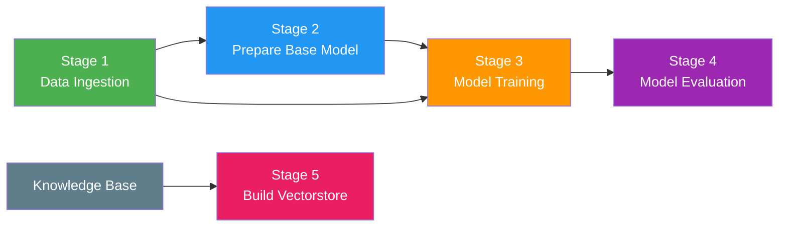

# 🔄 DVC Pipeline Flow

> Reproducible ML pipeline with 5 stages, tracked by DVC + MLflow.

---

## Pipeline Overview



```bash
dvc repro          # Run all stages
dvc repro -s model_training   # Run single stage + deps
dvc dag            # Visualize dependency graph
```

---

## Stage 1: Data Ingestion

| Detail | Value |
|--------|-------|
| **Script** | `src/tomato_disease_advisor/pipeline/stage_01_data_ingestion.py` |
| **Input** | PlantVillage dataset URL (config.yaml) |
| **Output** | `artifacts/data_ingestion/dataset/` (16,011 images, 10 classes) |
| **Tracked by** | DVC (`dvc.yaml` outs) |

**What it does:**
1. Downloads the zipped PlantVillage dataset from configured URL
2. Extracts to `artifacts/data_ingestion/dataset/`
3. Skips download if file already exists (idempotent)

---

## Stage 2: Prepare Base Model

| Detail | Value |
|--------|-------|
| **Script** | `src/tomato_disease_advisor/pipeline/stage_02_prepare_base_model.py` |
| **Input** | `IMAGE_SIZE` from params.yaml |
| **Output** | `artifacts/prepare_base_model/` (base + updated model) |
| **Params tracked** | `IMAGE_SIZE` |

**What it does:**
1. Dynamically selects EfficientNet variant based on `IMAGE_SIZE`:
   - 224 → EfficientNetB0, 240 → B1, 260 → B2, 300 → B3, 380 → B4
2. Downloads pretrained ImageNet weights
3. Freezes backbone layers
4. Adds custom classification head:
   - GlobalAveragePooling2D → Dropout(0.3) → Dense(256, ReLU) → Dense(10, softmax)
5. Saves both `base_model.keras` and `base_model_updated.keras`

---

## Stage 3: Model Training

| Detail | Value |
|--------|-------|
| **Script** | `src/tomato_disease_advisor/pipeline/stage_03_model_training.py` |
| **Input** | Dataset + prepared model |
| **Output** | `artifacts/training/model.keras` (~41 MB) |
| **Params tracked** | `EPOCHS`, `BATCH_SIZE`, `LEARNING_RATE` |
| **Tracking** | MLflow (params, metrics, artifacts) |

**Two-phase transfer learning:**

| Phase | Epochs | LR | Layers | Purpose |
|-------|--------|----|--------|---------|
| Phase 1 | 5 | 3×10⁻⁴ | Head only (backbone frozen) | Warm up classification head |
| Phase 2 | 25 | 1×10⁻⁴ | All layers unfrozen | Full fine-tuning |

**Callbacks:** ModelCheckpoint (save best), ReduceLROnPlateau (patience=3), EarlyStopping (patience=5)

**Augmentation:** rotation ±25°, shift 20%, shear 15%, zoom 20%, horizontal flip, brightness ±15%

---

## Stage 4: Model Evaluation

| Detail | Value |
|--------|-------|
| **Script** | `src/tomato_disease_advisor/pipeline/stage_04_model_evaluation.py` |
| **Input** | Trained model + test dataset |
| **Output** | `scores.json`, confusion matrix, training curves |
| **Metrics tracked** | accuracy, F1, precision, recall (DVC metrics) |

**What it does:**
1. Loads trained model and test data generator
2. Runs sanity check: generator classes == model output shape
3. Computes accuracy, F1, precision, recall (weighted)
4. Generates confusion matrix plot
5. Saves metrics to `scores.json` (DVC cache: false)
6. Logs everything to MLflow

---

## Stage 5: Build Vectorstore

| Detail | Value |
|--------|-------|
| **Script** | `src/tomato_disease_advisor/pipeline/stage_05_build_vectorstore.py` |
| **Input** | `knowledge/diseases/` + `knowledge/treatments/` (20 markdown files) |
| **Output** | `artifacts/vectorstore/` (FAISS index + metadata JSON) |

**What it does:**
1. Reads all markdown files from `knowledge/diseases/` and `knowledge/treatments/`
2. Chunks documents (1000 chars, 200 char overlap)
3. Embeds chunks using `all-MiniLM-L6-v2` (384-dim)
4. Builds FAISS `IndexFlatIP` (inner product = cosine similarity)
5. Saves `index.faiss`, `metadata.json`, `store_config.json`

---

## Experiment Tracking

```bash
mlflow ui          # Open http://localhost:5000
```

Every training + evaluation run logs to MLflow:
- **Parameters:** model name, image size, epochs, learning rate, batch size
- **Metrics:** train/val accuracy, train/val loss, F1, precision, recall
- **Artifacts:** model.keras, confusion matrix, scores.json
