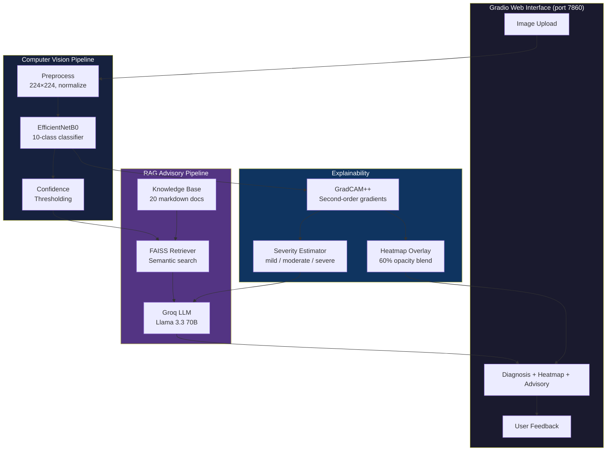
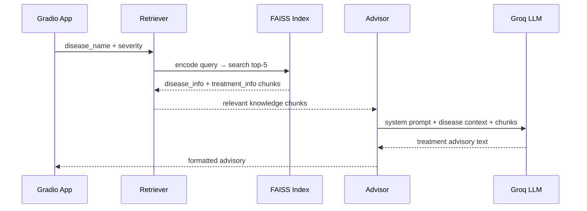

# 🏗️ Project Architecture & Flow

> End-to-end system design: from leaf image upload to AI-powered treatment advisory.

---

## System Architecture



---

## Component Deep Dive

### 1. Image Preprocessing

```
Raw Image → Resize(224, 224) → efficientnet.preprocess_input → [-1, 1] range
```

- Uses TensorFlow's built-in EfficientNet preprocessing (consistency with training)
- No manual normalization — avoids train/test skew

### 2. Disease Classification

**Model:** EfficientNetB0 with custom head

```
EfficientNetB0 (frozen/fine-tuned)
    → GlobalAveragePooling2D
    → Dropout(0.3)
    → Dense(256, ReLU)
    → Dense(10, Softmax)
```

**Confidence thresholds:**
- ≥ 70%: standard diagnosis
- < 70%: "uncertain" warning + expert consultation recommended

### 3. GradCAM++ Explainability

**Why GradCAM++ over GradCAM?**
- Uses second-order gradients (α and β weights)
- Better localization of small, scattered lesions
- More accurate pixel-importance attribution

**Implementation details:**
- Target layer: `top_conv` (last conv layer of EfficientNet)
- Fallback: searches nested models, then picks last Conv2D
- Output: heatmap overlaid on original image at 60% opacity

### 4. Severity Estimation

Derived from GradCAM++ activation map:

```
Affected Area % = (pixels with activation ≥ 0.5) / total_pixels × 100
```

| Level | Affected Area | Action |
|-------|--------------|--------|
| Healthy | Class is "healthy" | No action needed |
| Mild | < 10% | Monitor, preventive spraying |
| Moderate | 10–30% | Treatment recommended |
| Severe | > 30% | Immediate intervention critical |

### 5. RAG Advisory Pipeline



**Retrieval strategy:**
1. Convert class name → disease key (strip `Tomato_` prefix, normalize)
2. Search FAISS with metadata filter: `disease_filter` + `category_filter`
3. If no exact match: fall back to pure semantic search
4. Top-5 chunks per category (disease info + treatment info)

**LLM prompt structure:**
- System: "You are an expert agricultural advisor..."
- User: disease name + confidence + severity + retrieved context
- Output: structured advisory with dosages, organic alternatives, prevention

**Fallback:** If Groq API unavailable → raw treatment text from knowledge base

### 6. Feedback Collection

- JSONL file (`feedback.jsonl`)
- Each entry: timestamp, predicted class, confidence, severity, user verdict
- Used for monitoring model drift and identifying misclassifications

---

## Design Decisions & Rationale

### Why EfficientNetB0?

| Alternative | Why Not |
|-------------|---------|
| ResNet50 | 25.6M params (6× larger), lower accuracy-per-FLOP |
| VGG16 | 138M params, slow inference, no compound scaling |
| MobileNetV2 | Slightly lower accuracy on fine-grained lesion differentiation |
| EfficientNetB4 | 19M params — overkill for 10-class task, slower inference |

**EfficientNetB0** (4.3M params) hits the sweet spot: 99% accuracy with fast inference.

### Why Two-Phase Training?

| Approach | Risk |
|----------|------|
| Train all from scratch | Catastrophic forgetting of ImageNet features |
| Freeze backbone forever | Backbone can't adapt to leaf textures |
| **Two-phase** | Phase 1 stabilizes head → Phase 2 fine-tunes safely |

Phase 1 prevents the randomly-initialized head from sending large gradients through the backbone.

### Why FAISS over ChromaDB/Pinecone?

| Feature | FAISS | ChromaDB | Pinecone |
|---------|-------|----------|----------|
| Server needed | ❌ No | ✅ Yes | ✅ Yes (cloud) |
| Single-file persistence | ✅ | ❌ | ❌ |
| Speed (10K vectors) | ~0.1ms | ~5ms | ~20ms |
| Deployment complexity | Low | Medium | High |

For 20 documents with ~100 chunks, FAISS is the simplest, fastest choice.

### Why Groq over OpenAI?

| Factor | Groq | OpenAI |
|--------|------|--------|
| Cost | **Free tier** | Pay-per-token |
| Latency | ~200ms | ~1–3s |
| Model | Llama 3.3 70B | GPT-4 |
| Quality | Excellent for structured advisories | Slightly better creative text |

For agricultural advisories (structured, factual), Groq's free tier with Llama 3.3 70B is more than sufficient.

---

## 30-Second Pitch

> "I built an **AI-powered tomato disease advisory system** that goes beyond classification. Upload a leaf photo — the EfficientNetB0 model identifies the disease with **99% accuracy**, GradCAM++ shows _exactly where_ the disease is, and a RAG pipeline using FAISS + Groq LLM generates actionable treatment advice with specific dosages. The entire pipeline is DVC-reproducible, MLflow-tracked, Dockerized, and deployed to HuggingFace Spaces via GitHub Actions CI/CD. It's not just a classifier — it's a full diagnostic + advisory system."
